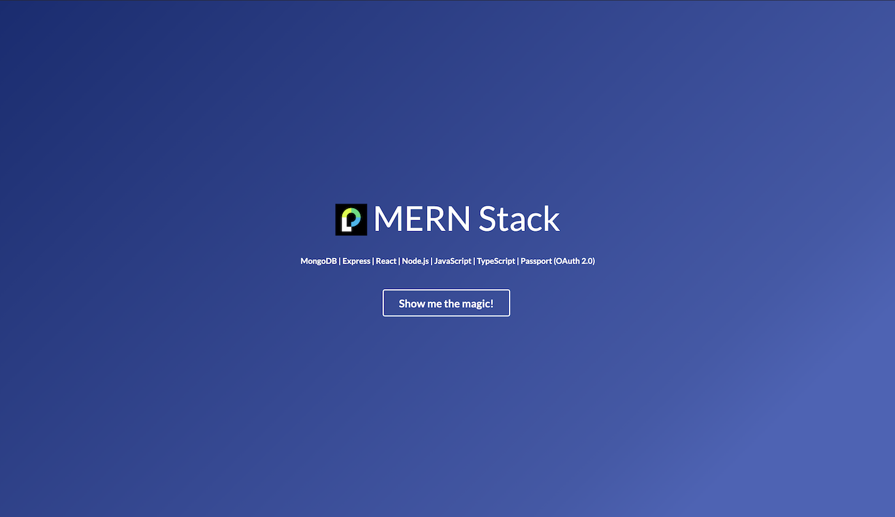
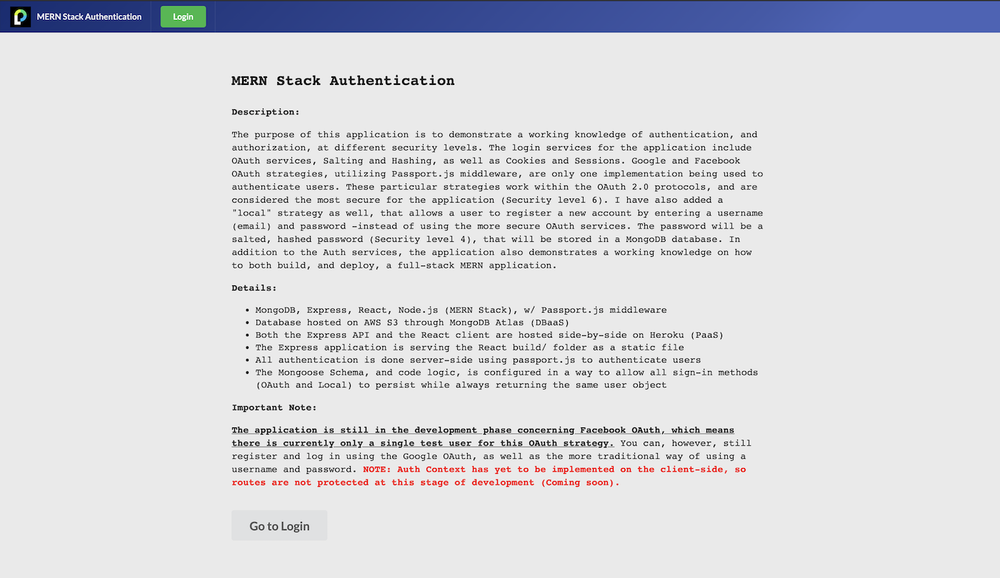
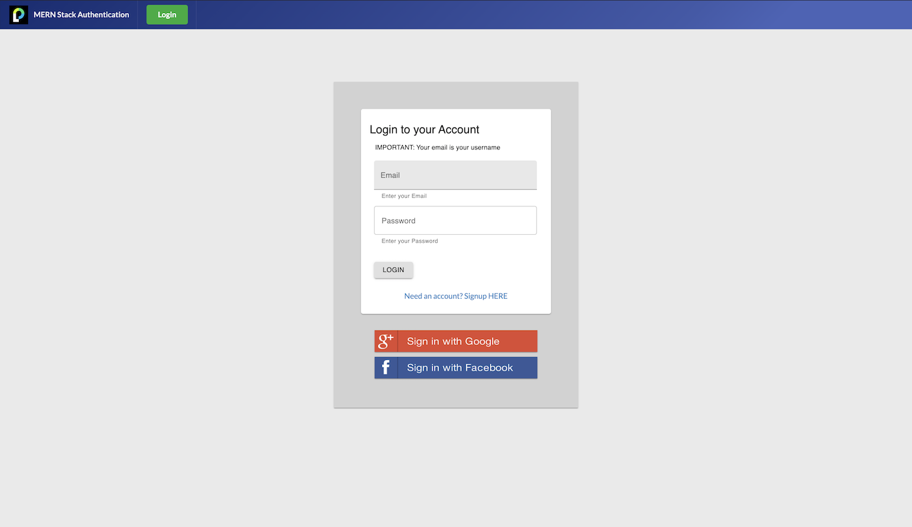

# MERN Stack Authentication

##### Live Demo: [MERN Stack Authentication Website](https://mern-stack-authentication.herokuapp.com/)

##### Repository: [github.com/ratta2ii/mern-stack-authorization](https://github.com/ratta2ii/mern-stack-authorization)

#
### Important Note:

The application is still in the development phase. Concerning Facebook OAuth, there is currently only a single test user for this OAuth strategy. You can, however, still register and log in using the Google OAuth, as well as the more traditional way of using a username and password. Please note though, that any Auth context has yet to be implemented on the client-side, so routes are not protected yet at this stage of development (Coming soon).

##### Landing Page

##### Dashboard

##### Login

#
### Description:
The purpose of this application is to demonstrate a working knowledge of authentication, and authorization, at different security levels. The login services for the application include OAuth services, Salting and Hashing, as well as Cookies and Sessions. Google and Facebook OAuth strategies, w/ Passport.js middleware, are only one of ways that a user can be authenticated. These particular strategies work within the OAuth 2.0 protocols, and are also considered the most secure for this application (Security level 6). I have also added a "local" strategy as well, that allows a user to register a new account by entering a username (email) and password -instead of using the more secure OAuth services. The password will be a salted, hashed password (Security level 4), that will be stored in a MongoDB database. In addition to the Auth services, the application also demonstrates a working knowledge on how to both build, and deploy, a full-stack MERN application.
### Project Objectives:

The primary goal of this application is to use this project as a demo app, as I undertake a deeper dive on Auth services. I want to both explore, as well as better understand, the complexity of various Identity Providers (IdP) and how to properly, and most notably, securely, authenticate users with their respective Service Providers.

### Project Details:

- MongoDB, Express, React, Node.js (MERN Stack), w/ Passport.js middleware
- Database hosted on AWS S3 through MongoDB Atlas (DBaaS)
- Both the Express API and the React client are hosted side-by-side on Heroku (PaaS)
- The Express application is serving the React build/ folder as a static file
- All authentication is done server-side using passport.js to authenticate users
- The Mongoose Schema, and code logic, is configured in a way to allow all sign-in methods (OAuth and Local) to persist while always returning the same user object.

# Security

### Register Users (TEXT)

##### _(Security: Level 1)_

### Database Encryption

##### _(Security: Level 2)_

    -npm install mongoose-encryption

### Hashing Passwords

##### _(Security: Level 3)_

    - npm install md5

### Hashing and Salting

##### _(Security: Level 4)_

    - npm install bycrypt

### Cookies and Sessions

##### _(Security: Level 5)_

    - npm install passport
    - npm install passport-local
    - npm install passport-local-mongoose
    - npm install express-session (NOT sessions)

### OAuth 2.0

##### _(Security: Level 6)_

###### (Example: Google, Facebook, GitHub, etc.)

_An "Auth Code" can be likened to an admit one ticket, whereas an "Access Token" can be likened to a year pass._
